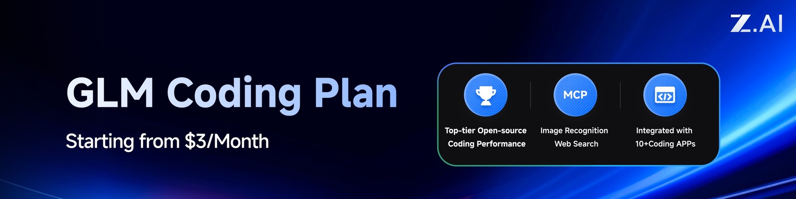
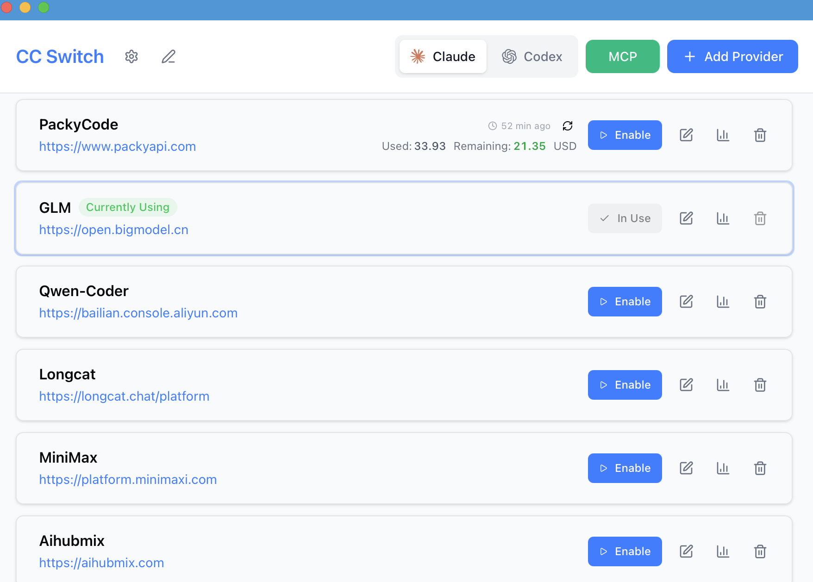
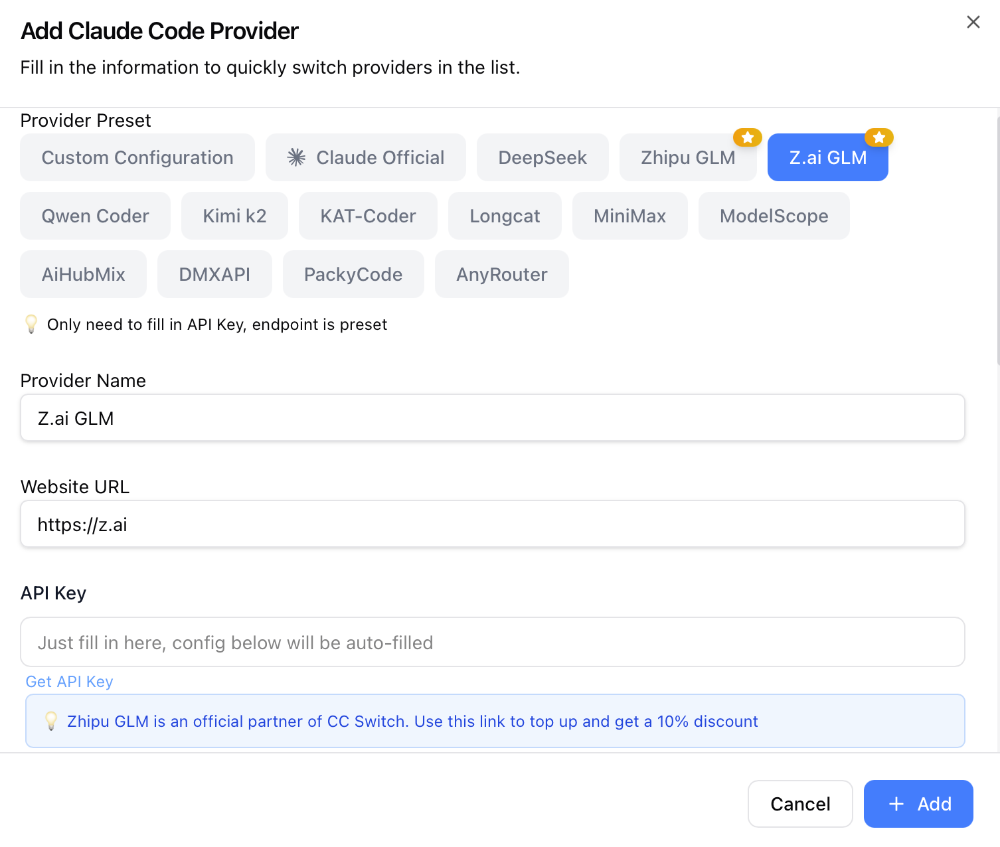

<div align="center">

# All-in-One Assistant for Claude Code, Codex & Gemini CLI

[](https://github.com/farion1231/cc-switch/releases)
[](https://github.com/trending/typescript)
[](https://github.com/farion1231/cc-switch/releases)
[](https://tauri.app/)
[](https://github.com/farion1231/cc-switch/releases/latest)

<a href="https://trendshift.io/repositories/15372" target="_blank"></a>

English | [中文](README_ZH.md) | [Changelog](CHANGELOG.md)

A desktop application for managing and switching between different provider configurations & MCP for Claude Code and Codex.

</div>

## ❤️Sponsor



This project is sponsored by Z.ai, supporting us with their GLM CODING PLAN.

GLM CODING PLAN is a subscription service designed for AI coding, starting at just $3/month. It provides access to their flagship GLM-4.6 model across 10+ popular AI coding tools (Claude Code, Cline, Roo Code, etc.), offering developers top-tier, fast, and stable coding experiences.

Get 10% OFF the GLM CODING PLAN with [this link](https://z.ai/subscribe?ic=8JVLJQFSKB)!

---

<table>
<tr>
<td width="180"></td>
<td>Thanks to PackyCode for sponsoring this project! PackyCode is a reliable and efficient API relay service provider, offering relay services for Claude Code, Codex, Gemini, and more. PackyCode provides special discounts for our software users: register using <a href="https://www.packyapi.com/register?aff=cc-switch">this link</a> and enter the "cc-switch" promo code during recharge to get 10% off.</td>
</tr>
</table>

## Screenshots

|                  Main Interface                   |                  Add Provider                  |
| :-----------------------------------------------: | :--------------------------------------------: |
|  |  |

## Features

### Current Version: v3.7.0 | [Full Changelog](CHANGELOG.md)

**Core Capabilities**

- **Provider Management**: One-click switching between Claude Code, Codex, and Gemini API configurations
- **MCP Integration**: Centralized MCP server management with stdio/http support and real-time sync
- **Speed Testing**: Measure API endpoint latency with visual quality indicators
- **Import/Export**: Backup and restore configs with auto-rotation (keep 10 most recent)
- **i18n Support**: Complete Chinese/English localization (UI, errors, tray)
- **Claude Plugin Sync**: One-click apply/restore Claude plugin configurations

**v3.6 Highlights**

- Provider duplication & drag-and-drop sorting
- Multi-endpoint management & custom config directory (cloud sync ready)
- Granular model configuration (4-tier: Haiku/Sonnet/Opus/Custom)
- WSL environment support with auto-sync on directory change
- 100% hooks test coverage & complete architecture refactoring
- New presets: DMXAPI, Azure Codex, AnyRouter, AiHubMix, MiniMax

**System Features**

- System tray with quick switching
- Single instance daemon
- Built-in auto-updater
- Atomic writes with rollback protection

## Download & Installation

### System Requirements

- **Windows**: Windows 10 and above
- **macOS**: macOS 10.15 (Catalina) and above
- **Linux**: Ubuntu 22.04+ / Debian 11+ / Fedora 34+ and other mainstream distributions

### Windows Users

Download the latest `CC-Switch-v{version}-Windows.msi` installer or `CC-Switch-v{version}-Windows-Portable.zip` portable version from the [Releases](../../releases) page.

### macOS Users

**Method 1: Install via Homebrew (Recommended)**

```bash
brew tap farion1231/ccswitch
brew install --cask cc-switch
```

Update:

```bash
brew upgrade --cask cc-switch
```

**Method 2: Manual Download**

Download `CC-Switch-v{version}-macOS.zip` from the [Releases](../../releases) page and extract to use.

> **Note**: Since the author doesn't have an Apple Developer account, you may see an "unidentified developer" warning on first launch. Please close it first, then go to "System Settings" → "Privacy & Security" → click "Open Anyway", and you'll be able to open it normally afterwards.

### ArchLinux 用户

**Install via paru (Recommended)**

```bash
paru -S cc-switch-bin
```

### Linux Users

Download the latest `CC-Switch-v{version}-Linux.deb` package or `CC-Switch-v{version}-Linux.AppImage` from the [Releases](../../releases) page.

## Quick Start

### Basic Usage

1. **Add Provider**: Click "Add Provider" → Choose preset or create custom configuration
2. **Switch Provider**:
   - Main UI: Select provider → Click "Enable"
   - System Tray: Click provider name directly (instant effect)
3. **Takes Effect**: Restart your terminal or Claude Code / Codex / Gemini clients to apply changes
4. **Back to Official**: Select the "Official Login" preset (Claude/Codex) or "Google Official" preset (Gemini), restart the corresponding client, then follow its login/OAuth flow

### MCP Management

- **Location**: Click "MCP" button in top-right corner
- **Add Server**: Use built-in templates (mcp-fetch, mcp-filesystem) or custom config
- **Enable/Disable**: Toggle switches to control which servers sync to live config
- **Sync**: Enabled servers auto-sync to `~/.claude.json` (Claude) or `~/.codex/config.toml` (Codex)

### Configuration Files

**Claude Code**

- Live config: `~/.claude/settings.json` (or `claude.json`)
- API key field: `env.ANTHROPIC_AUTH_TOKEN` or `env.ANTHROPIC_API_KEY`
- MCP servers: `~/.claude.json` → `mcpServers`

**Codex**

- Live config: `~/.codex/auth.json` (required) + `config.toml` (optional)
- API key field: `OPENAI_API_KEY` in `auth.json`
- MCP servers: `~/.codex/config.toml` → `[mcp_servers]` tables

**Gemini**

- Live config: `~/.gemini/.env` (API key) + `~/.gemini/settings.json` (auth type for quick switching)
- API key field: `GEMINI_API_KEY` inside `.env`
- Tray quick switch: each provider switch rewrites `~/.gemini/.env` so the Gemini CLI picks up the new credentials immediately

**CC Switch Storage**

- Main config (SSOT): `~/.cc-switch/config.json`
- Settings: `~/.cc-switch/settings.json`
- Backups: `~/.cc-switch/backups/` (auto-rotate, keep 10)

### Cloud Sync Setup

1. Go to Settings → "Custom Configuration Directory"
2. Choose your cloud sync folder (Dropbox, OneDrive, iCloud, etc.)
3. Restart app to apply
4. Repeat on other devices to enable cross-device sync

> **Note**: First launch auto-imports existing Claude/Codex configs as default provider.

## Architecture Overview

### Design Principles

```
┌─────────────────────────────────────────────────────────────┐
│                    Frontend (React + TS)                    │
│  ┌─────────────┐  ┌──────────────┐  ┌──────────────────┐    │
│  │ Components  │  │    Hooks     │  │  TanStack Query  │    │
│  │   (UI)      │──│ (Bus. Logic) │──│   (Cache/Sync)   │    │
│  └─────────────┘  └──────────────┘  └──────────────────┘    │
└────────────────────────┬────────────────────────────────────┘
                         │ Tauri IPC
┌────────────────────────▼────────────────────────────────────┐
│                  Backend (Tauri + Rust)                     │
│  ┌─────────────┐  ┌──────────────┐  ┌──────────────────┐    │
│  │  Commands   │  │   Services   │  │  Models/Config   │    │
│  │ (API Layer) │──│ (Bus. Layer) │──│     (Data)       │    │
│  └─────────────┘  └──────────────┘  └──────────────────┘    │
└─────────────────────────────────────────────────────────────┘
```

**Core Design Patterns**

- **SSOT** (Single Source of Truth): All provider configs stored in `~/.cc-switch/config.json`
- **Dual-way Sync**: Write to live files on switch, backfill from live when editing active provider
- **Atomic Writes**: Temp file + rename pattern prevents config corruption
- **Concurrency Safe**: RwLock with scoped guards avoids deadlocks
- **Layered Architecture**: Clear separation (Commands → Services → Models)

**Key Components**

- **ProviderService**: Provider CRUD, switching, backfill, sorting
- **McpService**: MCP server management, import/export, live file sync
- **ConfigService**: Config import/export, backup rotation
- **SpeedtestService**: API endpoint latency measurement

**v3.6 Refactoring**

- Backend: 5-phase refactoring (error handling → command split → tests → services → concurrency)
- Frontend: 4-stage refactoring (test infra → hooks → components → cleanup)
- Testing: 100% hooks coverage + integration tests (vitest + MSW)

## Development

### Environment Requirements

- Node.js 18+
- pnpm 8+
- Rust 1.85+
- Tauri CLI 2.8+

### Development Commands

```bash
# Install dependencies
pnpm install

# Dev mode (hot reload)
pnpm dev

# Type check
pnpm typecheck

# Format code
pnpm format

# Check code format
pnpm format:check

# Run frontend unit tests
pnpm test:unit

# Run tests in watch mode (recommended for development)
pnpm test:unit:watch

# Build application
pnpm build

# Build debug version
pnpm tauri build --debug
```

### Rust Backend Development

```bash
cd src-tauri

# Format Rust code
cargo fmt

# Run clippy checks
cargo clippy

# Run backend tests
cargo test

# Run specific tests
cargo test test_name

# Run tests with test-hooks feature
cargo test --features test-hooks
```

### Testing Guide (v3.6 New)

**Frontend Testing**:

- Uses **vitest** as test framework
- Uses **MSW (Mock Service Worker)** to mock Tauri API calls
- Uses **@testing-library/react** for component testing

**Test Coverage**:

- Hooks unit tests (100% coverage)
  - `useProviderActions` - Provider operations
  - `useMcpActions` - MCP management
  - `useSettings` series - Settings management
  - `useImportExport` - Import/export
- Integration tests
  - App main application flow
  - SettingsDialog complete interaction
  - MCP panel functionality

**Running Tests**:

```bash
# Run all tests
pnpm test:unit

# Watch mode (auto re-run)
pnpm test:unit:watch

# With coverage report
pnpm test:unit --coverage
```

## Tech Stack

**Frontend**: React 18 · TypeScript · Vite · TailwindCSS 4 · TanStack Query v5 · react-i18next · react-hook-form · zod · shadcn/ui · @dnd-kit

**Backend**: Tauri 2.8 · Rust · serde · tokio · thiserror · tauri-plugin-updater/process/dialog/store/log

**Testing**: vitest · MSW · @testing-library/react

## Project Structure

```
├── src/                      # Frontend (React + TypeScript)
│   ├── components/           # UI components (providers/settings/mcp/ui)
│   ├── hooks/                # Custom hooks (business logic)
│   ├── lib/
│   │   ├── api/              # Tauri API wrapper (type-safe)
│   │   └── query/            # TanStack Query config
│   ├── i18n/locales/         # Translations (zh/en)
│   ├── config/               # Presets (providers/mcp)
│   └── types/                # TypeScript definitions
├── src-tauri/                # Backend (Rust)
│   └── src/
│       ├── commands/         # Tauri command layer (by domain)
│       ├── services/         # Business logic layer
│       ├── app_config.rs     # Config data models
│       ├── provider.rs       # Provider domain models
│       ├── mcp.rs            # MCP sync & validation
│       └── lib.rs            # App entry & tray menu
├── tests/                    # Frontend tests
│   ├── hooks/                # Unit tests
│   └── components/           # Integration tests
└── assets/                   # Screenshots & partner resources
```

## Changelog

See [CHANGELOG.md](CHANGELOG.md) for version update details.

## Legacy Electron Version

[Releases](../../releases) retains v2.0.3 legacy Electron version

If you need legacy Electron code, you can pull the electron-legacy branch

## Contributing

Issues and suggestions are welcome!

Before submitting PRs, please ensure:

- Pass type check: `pnpm typecheck`
- Pass format check: `pnpm format:check`
- Pass unit tests: `pnpm test:unit`
- 💡 For new features, please open an issue for discussion before submitting a PR

## Star History

[](https://www.star-history.com/#farion1231/cc-switch&Date)

## License

MIT © Jason Young
