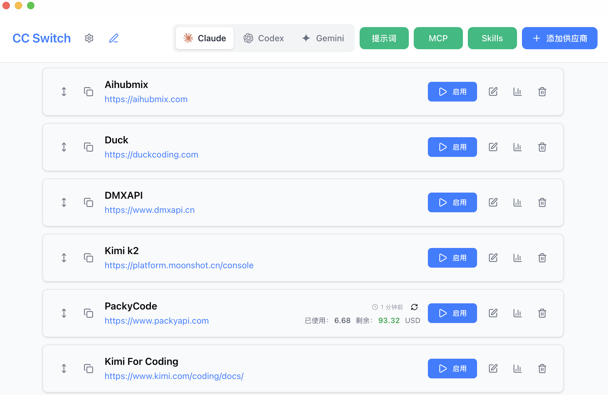
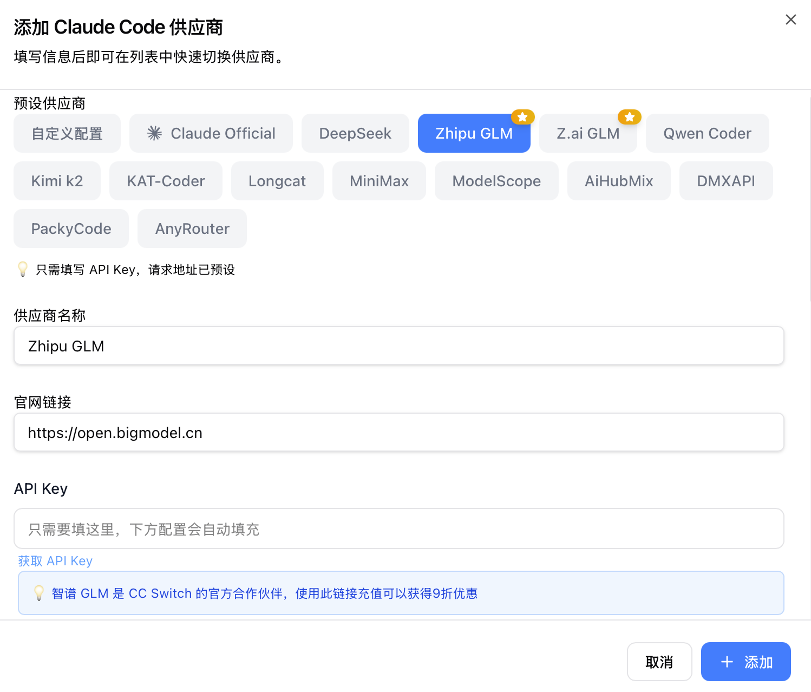

<div align="center">

# Claude Code & Codex 供应商管理器

[](https://github.com/farion1231/cc-switch/releases)
[](https://github.com/farion1231/cc-switch/releases)
[](https://tauri.app/)

[English](README.md) | 中文 | [更新日志](CHANGELOG.md)

一个用于管理和切换 Claude Code 与 Codex 不同供应商配置、MCP的桌面应用。

</div>

## ❤️ 赞助商


感谢智谱AI的 GLM CODING PLAN 赞助了本项目！

GLM CODING PLAN 是专为AI编码打造的订阅套餐，每月最低仅需20元，即可在十余款主流AI编码工具如 Claude Code、Cline 中畅享智谱旗舰模型 GLM-4.6，为开发者提供顶尖、高速、稳定的编码体验。

CC Switch 已经预设了智谱GLM，只需要填写 key 即可一键导入编程工具。智谱AI为本软件的用户提供了特别优惠，使用[此链接](https://www.bigmodel.cn/claude-code?ic=RRVJPB5SII)购买可以享受九折优惠。

## 更新记录

> **v3.6.0** ：新增编辑模式（供应商复制、手动排序）、自定义端点管理、使用量查询等功能，优化配置目录切换体验（WSL 环境完美支持），新增多个供应商预设（DMXAPI、Azure Codex、AnyRouter、AiHubMix、MiniMax），完成全栈架构重构和测试体系建设。

> v3.5.0 ：新增 MCP 管理、配置导入/导出、端点速度测试功能，完善国际化覆盖，新增 Longcat、kat-coder 预设，标准化发布文件命名规范。

> v3.4.0 ：新增 i18next 国际化、对新模型（qwen-3-max, GLM-4.6, DeepSeek-V3.2-Exp）的支持、Claude 插件、单实例守护、托盘最小化及安装器优化等。

> v3.3.0 ：VS Code Codex 插件一键配置/移除（默认自动同步）、Codex 通用配置片段与自定义向导增强、WSL 环境支持、跨平台托盘与 UI 优化。（该 VS Code 写入功能已在 v3.4.x 停用）

> v3.2.0 ：全新 UI、macOS系统托盘、内置更新器、原子写入与回滚、改进暗色样式、单一事实源（SSOT）与一次性迁移/归档。

> v3.1.0 ：新增 Codex 供应商管理与一键切换，支持导入当前 Codex 配置为默认供应商，并在内部配置从 v1 → v2 迁移前自动备份（详见下文“迁移与归档”）。

> v3.0.0 重大更新：从 Electron 完全迁移到 Tauri 2.0，应用体积显著降低、启动性能大幅提升。

## 功能特性（v3.6.0）

### 核心功能

- **MCP (Model Context Protocol) 管理**：完整的 MCP 服务器配置管理系统
  - 支持 stdio 和 http 服务器类型，并提供命令校验
  - 内置常用 MCP 服务器模板（如 mcp-fetch 等）
  - 实时启用/禁用 MCP 服务器，原子文件写入防止配置损坏
- **配置导入/导出**：备份和恢复你的供应商配置
  - 一键导出所有配置到 JSON 文件
  - 导入配置时自动验证并备份，自动轮换备份（保留最近 10 个）
  - 导入后自动同步到 live 配置文件，确保立即生效
- **端点速度测试**：测试 API 端点响应时间
  - 测量不同供应商端点的延迟，可视化连接质量指示器
  - 帮助用户选择最快的供应商
- **国际化与语言切换**：完整的 i18next 国际化覆盖（包含错误消息、托盘菜单、所有 UI 组件）
- **Claude 插件同步**：内置按钮可一键应用或恢复 Claude 插件配置，切换供应商后立即生效。

### v3.6 新增功能

- **供应商复制功能**：快速复制现有供应商配置，轻松创建变体配置
- **手动排序功能**：通过拖拽来对供应商进行手动排序
- **自定义端点管理**：支持聚合类供应商的多端点配置
- **自定义配置目录（云同步支持）**：
  - 自定义 CC Switch 的配置存储位置
  - 指定到云同步文件夹（Dropbox、OneDrive、iCloud、坚果云等）即可实现跨设备配置自动同步
  - 通过 Tauri Store 独立管理
- **Claude 配置数据结构增强**
  - **细粒度模型配置**：从双键系统升级到四键系统，以匹配官方最新数据结构
    - 新增字段：`ANTHROPIC_DEFAULT_HAIKU_MODEL`、`ANTHROPIC_DEFAULT_SONNET_MODEL`、`ANTHROPIC_DEFAULT_OPUS_MODEL`、`ANTHROPIC_MODEL`
    - 替换旧版 `ANTHROPIC_SMALL_FAST_MODEL`，支持自动迁移
    - 后端在首次读写时自动规范化旧配置，带有智能回退链
    - UI 从 2 个模型输入字段扩展到 4 个，具有智能默认值
  - 支持 `ANTHROPIC_API_KEY` 字段（除 `ANTHROPIC_AUTH_TOKEN` 外）
  - 模板变量系统，支持动态配置替换（如 KAT-Coder 的 ENDPOINT_ID）
  - 端点候选列表，用于速度测试和端点管理
  - 视觉主题配置（供应商卡片自定义图标和颜色）
  - 合作伙伴推广机制与国际化支持
- **供应商模型更新**
  - Kimi：更新到最新的 `kimi-k2-thinking`
- **使用量查询功能**
  - 自动刷新间隔：支持定时自动查询使用量
  - 测试脚本 API：测试 JavaScript 脚本是否正确
  - 模板系统扩展：自定义空白模板、支持 access token 和 user ID 参数
- **配置编辑器改进**
  - 新增 JSON 格式化按钮
  - 实时 TOML 语法验证（Codex 配置）
- **配置目录切换自动同步**：切换 Claude/Codex 配置目录（如切换到 WSL 环境）时，自动同步当前供应商到新目录，避免冲突导致配置文件混乱
- **编辑当前供应商时加载 live 配置**：编辑正在使用的供应商时，优先显示实际生效的配置，保护用户手动修改
- **新增供应商预设**：DMXAPI、Azure Codex、AnyRouter、AiHubMix、MiniMax
- **合作伙伴推广机制**：支持生态合作伙伴推广（如智谱 GLM Z.ai）

### v3.6 架构改进

- **后端重构**：完成 5 阶段重构（统一错误处理 → 命令层拆分 → 集成测试 → Service 层提取 → 并发优化）
- **前端重构**：完成 4 阶段重构（测试基础设施 → Hooks 提取 → 组件拆分 → 代码清理）
- **测试体系**：Hooks 单元测试 100% 覆盖，集成测试覆盖关键流程（vitest + MSW + @testing-library/react）

### 系统功能

- **系统托盘与窗口行为**：窗口关闭可最小化到托盘，macOS 支持托盘模式下隐藏/显示 Dock，托盘切换时同步 Claude/Codex/插件状态。
- **单实例**：保证同一时间仅运行一个实例，避免多开冲突。
- **标准化发布命名**：所有平台发布文件使用一致的版本标签命名（macOS: `.tar.gz` / `.zip`，Windows: `.msi` / `-Portable.zip`，Linux: `.AppImage` / `.deb`）。

## 界面预览

### 主界面



### 添加供应商



## 下载安装

### 系统要求

- **Windows**: Windows 10 及以上
- **macOS**: macOS 10.15 (Catalina) 及以上
- **Linux**: Ubuntu 22.04+ / Debian 11+ / Fedora 34+ 等主流发行版

### Windows 用户

从 [Releases](../../releases) 页面下载最新版本的 `CC-Switch-v{版本号}-Windows.msi` 安装包或者 `CC-Switch-v{版本号}-Windows-Portable.zip` 绿色版。

### macOS 用户

**方式一：通过 Homebrew 安装（推荐）**

```bash
brew tap farion1231/ccswitch
brew install --cask cc-switch
```

更新：

```bash
brew upgrade --cask cc-switch
```

**方式二：手动下载**

从 [Releases](../../releases) 页面下载 `CC-Switch-v{版本号}-macOS.zip` 解压使用。

> **注意**：由于作者没有苹果开发者账号，首次打开可能出现"未知开发者"警告，请先关闭，然后前往"系统设置" → "隐私与安全性" → 点击"仍要打开"，之后便可以正常打开

### Linux 用户

从 [Releases](../../releases) 页面下载最新版本的 `CC-Switch-v{版本号}-Linux.deb` 包或者 `CC-Switch-v{版本号}-Linux.AppImage` 安装包。

## 使用说明

1. 点击"添加供应商"添加你的 API 配置
2. 切换方式：
   - 在主界面选择供应商后点击切换
   - 或通过“系统托盘（菜单栏）”直接选择目标供应商，立即生效
3. 切换会写入对应应用的“live 配置文件”（Claude：`settings.json`；Codex：`auth.json` + `config.toml`）
4. 重启或新开终端以确保生效
5. 若需切回官方登录，在预设中选择“官方登录”并切换即可；重启终端后按官方流程登录

### MCP 配置说明（v3.5.x）

- 管理位置：所有 MCP 服务器定义集中保存在 `~/.cc-switch/config.json`（按客户端 `claude` / `codex` 分类）
- 同步机制：
  - 启用的 Claude MCP 会投影到 `~/.claude.json`（路径可随覆盖目录而变化）
  - 启用的 Codex MCP 会投影到 `~/.codex/config.toml`
- 校验与归一化：新增/导入时自动校验字段合法性（stdio/http），并自动修复/填充 `id` 等键名
- 导入来源：支持从 `~/.claude.json` 与 `~/.codex/config.toml` 导入；已存在条目只强制 `enabled=true`，不覆盖其他字段

### 检查更新

- 在“设置”中点击“检查更新”，若内置 Updater 配置可用将直接检测与下载；否则会回退打开 Releases 页面

### Codex 说明（SSOT）

- 配置目录：`~/.codex/`
  - live 主配置：`auth.json`（必需）、`config.toml`（可为空）
- API Key 字段：`auth.json` 中使用 `OPENAI_API_KEY`
- 切换行为（不再写“副本文件”）：
  - 供应商配置统一保存在 `~/.cc-switch/config.json`
  - 切换时将目标供应商写回 live 文件（`auth.json` + `config.toml`）
  - 采用“原子写入 + 失败回滚”，避免半写状态；`config.toml` 可为空
- 导入默认：当该应用无任何供应商时，从现有 live 主配置创建一条默认项并设为当前
- 官方登录：可切换到预设“Codex 官方登录”，重启终端后按官方流程登录

### Claude Code 说明（SSOT）

- 配置目录：`~/.claude/`
  - live 主配置：`settings.json`（优先）或历史兼容 `claude.json`
- API Key 字段：`env.ANTHROPIC_AUTH_TOKEN`
- 切换行为（不再写“副本文件”）：
  - 供应商配置统一保存在 `~/.cc-switch/config.json`
  - 切换时将目标供应商 JSON 直接写入 live 文件（优先 `settings.json`）
  - 编辑当前供应商时，先写 live 成功，再更新应用主配置，保证一致性
- 导入默认：当该应用无任何供应商时，从现有 live 主配置创建一条默认项并设为当前
- 官方登录：可切换到预设“Claude 官方登录”，重启终端后可使用 `/login` 完成登录

### 迁移与归档

#### v3.6 技术改进

**内部优化（用户无感知）**：

- **移除遗留迁移逻辑**：v3.6 移除了 v1 配置自动迁移和副本文件扫描逻辑
  - **影响**：启动性能提升，代码更简洁
  - **兼容性**：v2 格式配置完全兼容，无需任何操作
  - ⚠️ **注意**：从 v3.1.0 或更早版本升级的用户，请先升级到 v3.2.x 或 v3.5.x 完成一次性迁移，再升级到 v3.6

- **命令参数标准化**：后端统一使用 `app` 参数（取值：`claude` 或 `codex`）
  - **影响**：代码更规范，错误提示更友好
  - **兼容性**：前端已完全适配，用户无需关心此变更

#### 启动失败与恢复

- 触发条件：`~/.cc-switch/config.json` 不存在、损坏或解析失败时触发。
- 用户动作：根据弹窗提示检查 JSON 语法，或从备份文件恢复。
- 备份位置与轮换：`~/.cc-switch/backups/backup_YYYYMMDD_HHMMSS.json`（最多保留 10 个，参见 `src-tauri/src/services/config.rs`）。
- 退出策略：为保护数据安全，出现上述错误时应用会弹窗提示并强制退出；修复后重新启动即可。

#### v3.2.0 起的迁移机制

- 一次性迁移：首次启动 3.2.0 及以上版本会扫描旧的"副本文件"并合并到 `~/.cc-switch/config.json`
  - Claude：`~/.claude/settings-*.json`（排除 `settings.json` / 历史 `claude.json`）
  - Codex：`~/.codex/auth-*.json` 与 `config-*.toml`（按名称成对合并）
- 去重与当前项：按"名称（忽略大小写）+ API Key"去重；若当前为空，将 live 合并项设为当前
- 归档与清理：
  - 归档目录：`~/.cc-switch/archive/<timestamp>/<category>/...`
  - 归档成功后删除原副本；失败则保留原文件（保守策略）
- v1 → v2 结构升级：会额外生成 `~/.cc-switch/config.v1.backup.<timestamp>.json` 以便回滚
- 注意：迁移后不再持续归档日常切换/编辑操作，如需长期审计请自备备份方案

## 架构总览（v3.6）

### 架构重构亮点（v3.6）

**后端重构（Rust）**：完成 5 阶段重构

- **Phase 1**：统一错误处理（`AppError` + 国际化错误消息）
- **Phase 2**：命令层按领域拆分（`commands/{provider,mcp,config,settings,plugin,misc}.rs`）
- **Phase 3**：引入集成测试和事务机制（配置快照 + 失败回滚）
- **Phase 4**：提取 Service 层（`services/{provider,mcp,config,speedtest}.rs`）
- **Phase 5**：并发优化（`RwLock` 替代 `Mutex`，作用域 guard 避免死锁）

**前端重构（React + TypeScript）**：完成 4 阶段重构

- **Stage 1**：建立测试基础设施（vitest + MSW + @testing-library/react）
- **Stage 2**：提取自定义 hooks（`useProviderActions`, `useMcpActions`, `useSettings`, `useImportExport` 等）
- **Stage 3**：组件拆分和业务逻辑提取
- **Stage 4**：代码清理和格式化统一

**测试覆盖**：

- Hooks 单元测试 100% 覆盖
- 集成测试覆盖关键流程（App、SettingsDialog、MCP 面板）
- MSW 模拟后端 API，确保测试独立性

### 分层架构

- **前端（Renderer）**
  - 技术栈：TypeScript + React 18 + Vite + TailwindCSS 4
  - 数据层：TanStack React Query 统一查询与变更（`@/lib/query`），Tauri API 统一封装（`@/lib/api`）
  - 业务逻辑层：自定义 Hooks（`@/hooks`）承载领域逻辑，组件保持简洁
  - 事件流：监听后端 `provider-switched` 事件，驱动 UI 刷新与托盘状态一致
  - 组织结构：按领域拆分组件（`providers/settings/mcp/ui`）

- **后端（Tauri + Rust）**
  - **Commands 层**（接口层）：`src-tauri/src/commands/*` 按领域拆分，仅负责参数解析和权限校验
  - **Services 层**（业务层）：`src-tauri/src/services/*` 承载核心逻辑，可复用和测试
    - `ProviderService`：供应商增删改查、切换、回填、排序
    - `McpService`：MCP 服务器管理、导入导出、同步
    - `ConfigService`：配置文件导入导出、备份恢复
    - `SpeedtestService`：API 端点延迟测试
  - **模型与状态**：
    - `provider.rs`：领域模型（`Provider`, `ProviderManager`, `ProviderMeta`）
    - `app_config.rs`：多应用配置（`MultiAppConfig`, `AppId`, `McpRoot`）
    - `store.rs`：全局状态（`AppState` + `RwLock<MultiAppConfig>`）
  - **可靠性**：
    - 统一错误类型 `AppError`（包含本地化消息）
    - 事务式变更（配置快照 + 失败回滚）
    - 原子写入（临时文件 + 重命名，避免半写入）
    - 托盘菜单与事件：切换后重建菜单并向前端发射 `provider-switched` 事件

- **设计要点（SSOT + 双向同步）**
  - **单一事实源**：供应商配置集中存放于 `~/.cc-switch/config.json`
  - **切换时写入**：将目标供应商配置写入 live 文件（Claude: `settings.json`；Codex: `auth.json` + `config.toml`）
  - **回填机制**：切换后立即读回 live 文件，更新 SSOT，保护用户手动修改
  - **目录切换同步**：修改配置目录时自动同步当前供应商到新目录（WSL 环境完美支持）
  - **编辑时优先 live**：编辑当前供应商时，优先加载 live 配置，确保显示实际生效的配置

- **兼容性与变更**
  - 命令参数统一：Tauri 命令仅接受 `app`（值为 `claude` / `codex`）
  - 前端类型统一：使用 `AppId` 表达应用标识（替代历史 `AppType` 导出）

## 开发

### 环境要求

- Node.js 18+
- pnpm 8+
- Rust 1.85+
- Tauri CLI 2.8+

### 开发命令

```bash
# 安装依赖
pnpm install

# 开发模式（热重载）
pnpm dev

# 类型检查
pnpm typecheck

# 代码格式化
pnpm format

# 检查代码格式
pnpm format:check

# 运行前端单元测试
pnpm test:unit

# 监听模式运行测试（推荐开发时使用）
pnpm test:unit:watch

# 构建应用
pnpm build

# 构建调试版本
pnpm tauri build --debug
```

### Rust 后端开发

```bash
cd src-tauri

# 格式化 Rust 代码
cargo fmt

# 运行 clippy 检查
cargo clippy

# 运行后端测试
cargo test

# 运行特定测试
cargo test test_name

# 运行带测试 hooks 的测试
cargo test --features test-hooks
```

### 测试说明（v3.6 新增）

**前端测试**：

- 使用 **vitest** 作为测试框架
- 使用 **MSW (Mock Service Worker)** 模拟 Tauri API 调用
- 使用 **@testing-library/react** 进行组件测试

**测试覆盖**：

- ✅ Hooks 单元测试（100% 覆盖）
  - `useProviderActions` - 供应商操作
  - `useMcpActions` - MCP 管理
  - `useSettings` 系列 - 设置管理
  - `useImportExport` - 导入导出
- ✅ 集成测试
  - App 主应用流程
  - SettingsDialog 完整交互
  - MCP 面板功能

**运行测试**：

```bash
# 运行所有测试
pnpm test:unit

# 监听模式（自动重跑）
pnpm test:unit:watch

# 带覆盖率报告
pnpm test:unit --coverage
```

## 技术栈

### 前端

- **[React 18](https://react.dev/)** - 用户界面库
- **[TypeScript](https://www.typescriptlang.org/)** - 类型安全的 JavaScript
- **[Vite](https://vitejs.dev/)** - 极速的前端构建工具
- **[TailwindCSS 4](https://tailwindcss.com/)** - 实用优先的 CSS 框架
- **[TanStack Query v5](https://tanstack.com/query/latest)** - 强大的数据获取与缓存
- **[react-i18next](https://react.i18next.com/)** - React 国际化框架
- **[react-hook-form](https://react-hook-form.com/)** - 高性能表单库
- **[zod](https://zod.dev/)** - TypeScript 优先的模式验证
- **[shadcn/ui](https://ui.shadcn.com/)** - 可复用的 React 组件
- **[@dnd-kit](https://dndkit.com/)** - 现代拖拽工具包

### 后端

- **[Tauri 2.8](https://tauri.app/)** - 跨平台桌面应用框架
  - tauri-plugin-updater - 自动更新
  - tauri-plugin-process - 进程管理
  - tauri-plugin-dialog - 文件对话框
  - tauri-plugin-store - 持久化存储
  - tauri-plugin-log - 日志记录
- **[Rust](https://www.rust-lang.org/)** - 系统级编程语言
- **[serde](https://serde.rs/)** - 序列化/反序列化框架
- **[tokio](https://tokio.rs/)** - 异步运行时
- **[thiserror](https://github.com/dtolnay/thiserror)** - 错误处理派生宏

### 测试工具

- **[vitest](https://vitest.dev/)** - 快速的单元测试框架
- **[MSW](https://mswjs.io/)** - API mock 工具
- **[@testing-library/react](https://testing-library.com/react)** - React 测试工具

## 项目结构

```
├── src/                      # 前端代码 (React + TypeScript)
│   ├── components/           # React 组件
│   │   ├── providers/        # 供应商管理组件
│   │   │   ├── forms/        # 表单子组件（Claude/Codex 字段）
│   │   │   ├── ProviderList.tsx
│   │   │   ├── ProviderForm.tsx
│   │   │   ├── AddProviderDialog.tsx
│   │   │   └── EditProviderDialog.tsx
│   │   ├── settings/         # 设置相关组件
│   │   │   ├── SettingsDialog.tsx
│   │   │   ├── DirectorySettings.tsx
│   │   │   └── ImportExportSection.tsx
│   │   ├── mcp/              # MCP 管理组件
│   │   │   ├── McpPanel.tsx
│   │   │   ├── McpFormModal.tsx
│   │   │   └── McpWizard.tsx
│   │   └── ui/               # shadcn/ui 基础组件
│   ├── hooks/                # 自定义 Hooks（业务逻辑层）
│   │   ├── useProviderActions.ts    # 供应商操作
│   │   ├── useMcpActions.ts         # MCP 操作
│   │   ├── useSettings.ts           # 设置管理
│   │   ├── useImportExport.ts       # 导入导出
│   │   └── useDirectorySettings.ts  # 目录配置
│   ├── lib/
│   │   ├── api/              # Tauri API 封装（类型安全）
│   │   │   ├── providers.ts  # 供应商 API
│   │   │   ├── settings.ts   # 设置 API
│   │   │   ├── mcp.ts        # MCP API
│   │   │   └── usage.ts      # 用量查询 API
│   │   └── query/            # TanStack Query 配置
│   │       ├── queries.ts    # 查询定义
│   │       ├── mutations.ts  # 变更定义
│   │       └── queryClient.ts
│   ├── i18n/                 # 国际化资源
│   │   └── locales/
│   │       ├── zh/           # 中文翻译
│   │       └── en/           # 英文翻译
│   ├── config/               # 配置与预设
│   │   ├── claudeProviderPresets.ts  # Claude 供应商预设
│   │   ├── codexProviderPresets.ts   # Codex 供应商预设
│   │   └── mcpPresets.ts             # MCP 服务器模板
│   ├── utils/                # 工具函数
│   │   ├── postChangeSync.ts         # 配置同步工具
│   │   └── ...
│   └── types/                # TypeScript 类型定义
├── src-tauri/                # 后端代码 (Rust)
│   ├── src/
│   │   ├── commands/         # Tauri 命令层（按领域拆分）
│   │   │   ├── provider.rs   # 供应商命令
│   │   │   ├── mcp.rs        # MCP 命令
│   │   │   ├── config.rs     # 配置查询命令
│   │   │   ├── settings.rs   # 设置命令
│   │   │   ├── plugin.rs     # 插件命令
│   │   │   ├── import_export.rs  # 导入导出命令
│   │   │   └── misc.rs       # 杂项命令
│   │   ├── services/         # Service 层（业务逻辑）
│   │   │   ├── provider.rs   # ProviderService
│   │   │   ├── mcp.rs        # McpService
│   │   │   ├── config.rs     # ConfigService
│   │   │   └── speedtest.rs  # SpeedtestService
│   │   ├── app_config.rs     # 配置数据模型
│   │   ├── provider.rs       # 供应商领域模型
│   │   ├── store.rs          # 全局状态管理
│   │   ├── mcp.rs            # MCP 同步与校验
│   │   ├── error.rs          # 统一错误类型
│   │   ├── usage_script.rs   # 用量脚本执行
│   │   ├── claude_plugin.rs  # Claude 插件管理
│   │   └── lib.rs            # 应用入口
│   ├── capabilities/         # Tauri 权限配置
│   └── icons/                # 应用图标
├── tests/                    # 前端测试（v3.6 新增）
│   ├── hooks/                # Hooks 单元测试
│   ├── components/           # 组件集成测试
│   └── setup.ts              # 测试配置
└── assets/                   # 静态资源
    ├── screenshots/          # 界面截图
    └── partners/             # 合作商资源
        ├── logos/            # 合作商 Logo
        └── banners/          # 合作商横幅/宣传图
```

## 更新日志

查看 [CHANGELOG.md](CHANGELOG.md) 了解版本更新详情。

## Electron 旧版

[Releases](../../releases) 里保留 v2.0.3 Electron 旧版

如果需要旧版 Electron 代码，可以拉取 electron-legacy 分支

## 贡献

欢迎提交 Issue 反馈问题和建议！

提交 PR 前请确保：

- 通过类型检查：`pnpm typecheck`
- 通过格式检查：`pnpm format:check`
- 通过单元测试：`pnpm test:unit`
- 功能性 PR 请先经过 issue 区讨论

## Star History

[](https://www.star-history.com/#farion1231/cc-switch&Date)

## License

MIT © Jason Young
